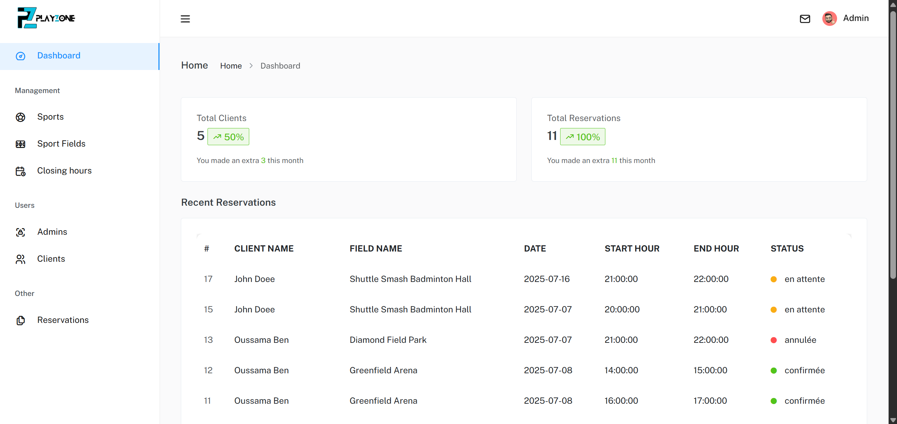
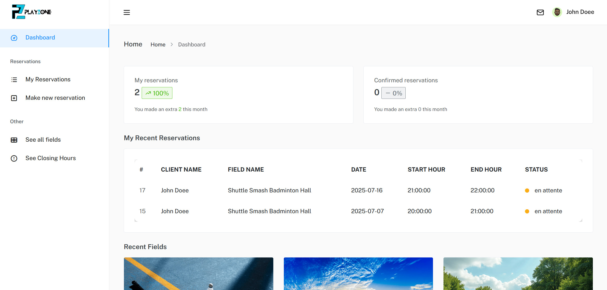
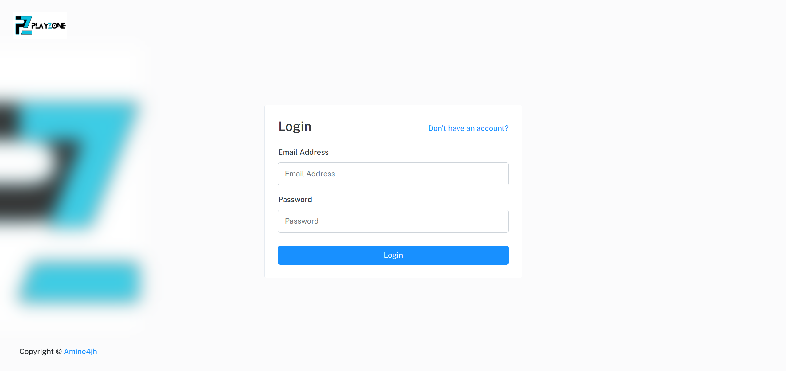

<div align="center">
<h1 align="center">🏟️ PlayZone | PHP Sport Field Reservation System</h1>

PlayZone is a web application built with PHP that allows users to register, log in, and reserve sports fields (Tennis, Padel, Football, ...). It features role-based access control, reservation management, field administration, and time slot validation. The project is built with PHP and MySQL on the backend and HTML/CSS/Bootstrap/JavaScript on the frontend.

<a href="https://playzone.infinityfree.me/"><strong>➥ Live Demo</strong></a>

</div>

---

## 📌 Project Objectives

- Allow users to **register, log in**, and **reserve sports fields**
- Enable administrators to manage **sports**, **fields**, **closed hours**, and **reservations**
- Prevent overlapping bookings and handle **closed periods**
- Ensure **security** through proper validation and protection against attacks

---

## 🛠️ Technologies Used

- **Backend:** PHP
- **Database:** MySQL
- **Frontend:** HTML5, CSS3, Bootstrap, JavaScript
- **Security:** Prepared statements, input validation, `password_hash()`, `password_verify()`

---

## 🗃️ Database Schema Overview

### `utilisateurs`

| Field         | Type        | Description          |
| ------------- | ----------- | -------------------- |
| id            | INT, PK, AI | User ID              |
| nom           | VARCHAR     | Full name            |
| email         | VARCHAR     | Unique email         |
| password_hash | VARCHAR     | Hashed password      |
| role          | ENUM        | 'admin' or 'client'  |
| created_at    | DATE        | Acoount created date |
| avatar        | VARCHAR     | avatar image         |

### `sports`

| Field | Type        | Description |
| ----- | ----------- | ----------- |
| id    | INT, PK, AI | Sport ID    |
| nom   | VARCHAR     | Sport name  |

### `terrains`

| Field    | Type        | Description          |
| -------- | ----------- | -------------------- |
| id       | INT, PK, AI | Field ID             |
| address  | TEXT        | Field location       |
| sport_id | INT, FK     | Linked sport         |
| nom      | VARCHAR     | Field name or number |
| image    | VARCHAR     | Field image          |

### `reservation`

| Field       | Type        | Description                          |
| ----------- | ----------- | ------------------------------------ |
| id          | INT, PK, AI | Reservation ID                       |
| user_id     | INT, FK     | ID of the user                       |
| terrain_id  | INT, FK     | ID of the reserved field             |
| date        | DATE        | Date of reservation                  |
| heure_debut | TIME        | Start time                           |
| heure_fin   | TIME        | End time                             |
| statut      | ENUM        | 'en attente', 'confirmée', 'annulée' |

### `date_heures_fermees`

| Field           | Type        | Description        |
| --------------- | ----------- | ------------------ |
| id              | INT, PK, AI | Closed hours ID    |
| terrain_id      | INT, FK     | Field affected     |
| date            | DATE        | Closure date       |
| debut_fermeture | TIME        | Start time         |
| fin_fermeture   | TIME        | End time           |
| motif           | TEXT        | Reason for closure |

---

## ✅ User Features

- **Registration & Login** with email and hashed password
- **Dashboard**:
  - View insights (Total Reseravtions, Reseravtions Confirmed)
  - View recent reservations (Last 5 reservations added of user)
  - View recent fields (Last 3 fields added)
- **My Reservations**:
  - View all reservations
  - Cancel pending reservations
  - Filter by date, location, and sport
- **Make new Reservations**:
  - Make reservation form
  - Choose sport → field → time slot
  - Display availability
  - Prevent overlapping and invalid bookings
- **See all fields**:
  - See all fields available and reserve
- **See closing hours**:
  - See all closing hours exist

---

## 🔧 Admin Features

- **Dashboard**:
  - View insights (Total Client, Total Reservations)
  - View recent reservations (Last 10 reservations added)
- **Manage Sports**: Add, rename, or delete sports
- **Manage Fields**: Add, edit, delete fields
- **Closed Hours**: Set field closures with reasons
- **Manage Clients**: Set client as admin and admin as client, delete users
- **View Reservations**: Filter by user, field, and date; update status (Confirm or Cancel)

---

## 🔐 Security Measures

- **Server-side validation** of all inputs
- **Prevent SQL Injection** using prepared statements
- **Prevent XSS** using `htmlspecialchars()`
- Ensure logical constraints:
  - No overlapping or past reservations
  - Must book at least 1 hour in advance

---

## ⚠️ Booking Rules

- ❌ Booking not allowed:
  - If user is not logged in
  - During closed hours
- ✅ Booking allowed only:
  - For future dates
  - At least 1 hour before the reservation time

---

## ⚙️ How to Run Locally

1. Install WAMP or XAMPP

2. Clone this repo:

```bash
git clone https://github.com/Amine4jh/PHP_sport_field_reservation
```

3. Start Apache & MySQL

4. Visit http://localhost/PHP_sport_field_reservation

---

## 📌 Author

Developed by **Amine Ajaha**  
GitHub: [Amine4jh](https://github.com/Amine4jh)

---

## 📸 Screenshots

- **Admin Dashboard**:
  

- **Client Dashboard**:
  

- **Login**:
  

- **Registration**:
  
